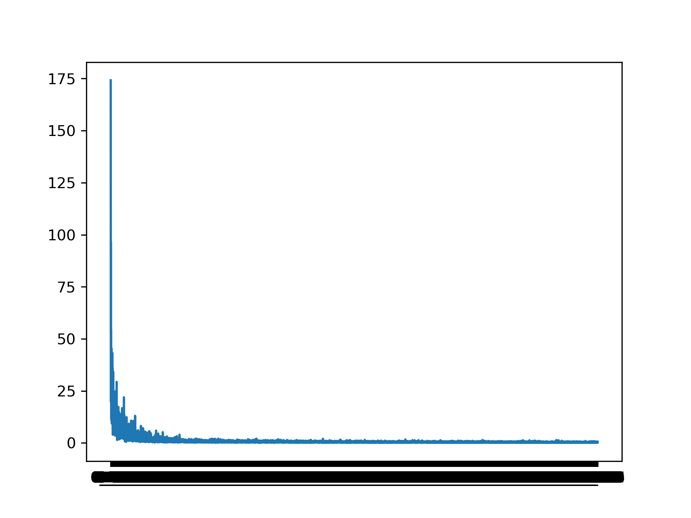
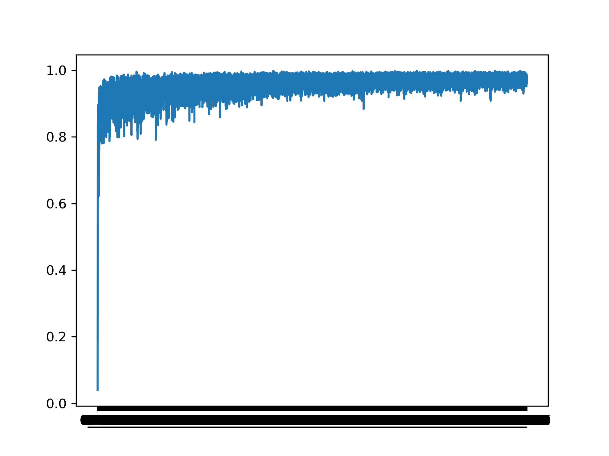
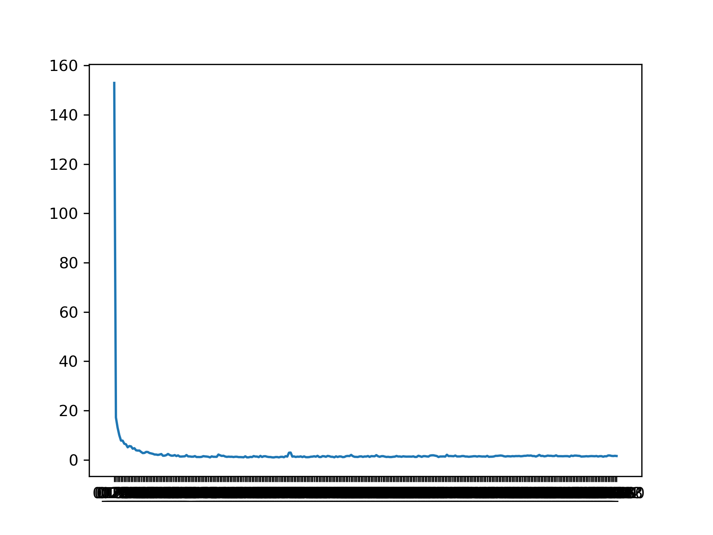
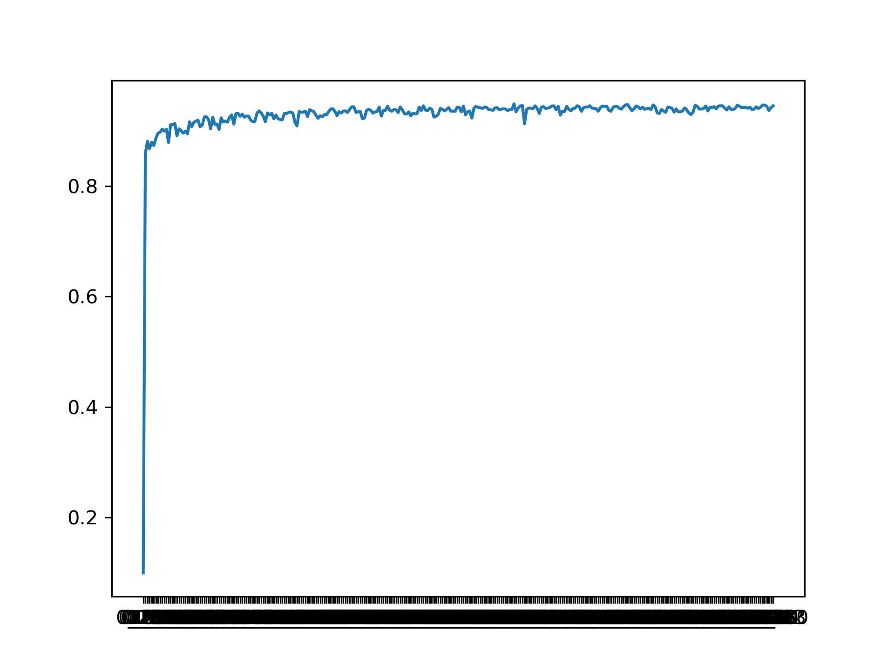
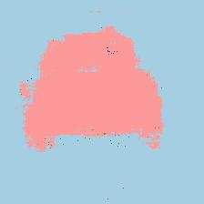

# FCN

## Environment

      python =3.6.8

      tensorflow= 1.14.0

      opencv=3.4.3

      numpy=1.16.1

      matplotlib = 3.1.1

      CUDA = 10.0

      CUDNN = 7.4.1

      GPU = NVIDIA GTX 1660

## Result

 </img> 
 </img> 

       Train Loss Graph                Train Accuracy Graph

 </img>
 </img> 

     Validation Loss Graph          Validation Accuracy Graph
     
     
 </img> 
 </img> 

 </img> 
 </img> 

     
     
     
     
# How To Use It?

Download DataSet, (I used Pascal Voc 2012)

Make Label Data like my label data

Run

    train.py --train_dir Train_DataSet_Path --train_gt_dir Train_Ground_Truth_Path --test_dir Test_DataSet_Path --test_gt_dir Test_Ground_Truth_Path --label Label_DataSet_Path(Must be made txt file) [optional : --lr Learning_Rate --epoch Epochs_you_want --keep_prob Keep_Probs_For_Drop_Out --batch_size Batch_Size --save_dir Save_Directory_Folder]

## Demo Use

Run

     demo.py --test_dir Test_DataSet_Path --label Label_DataSet_File --model Saved_Model_Load

